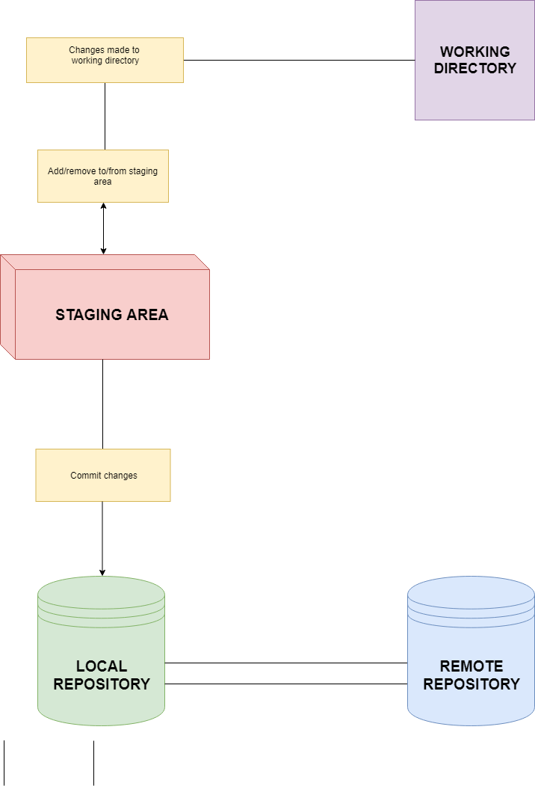

# Git and GitHub
- Installation
    - For installation on different OS read the blog [here]()
- Repositories
    - Repositories, usually called **repos**, store the full history and source control of a project.
    - They can either be hosted locally, or on a shared server, such as GitHub.
    - Most repositories are stored on GitHub, while core contributors make copies of the repository on their machine and update the repository using the push/pull system.
    - Any repository stored somewhere other than locally is called a ‘remote repository’.
- Git Workflow
    - Before Git tracks a change, it goes through a long chain of operations and tasks.
    - This diagram shows a little bit about how the basic Git workflow process works
    
    - The staging area is the bundle of all the modifications to the project that are going to be committed.
    - A ‘commit’ is similar to taking a snapshot of the current state of the project, then storing it on a timeline.

## Creating a Simple Git repo
#### Follow the following steps
1. Make a directory `my_project`
2. Initialize the git repo using command `git init`
3. Add some sample files
```
    touch test.c test1.py test3.js Readme.md
```
4. Add some files to the staging area
    - In git only staged files can be committed, so make sure to stage required files.
    - To stage files use `git add <file_name>`
    - For example you have to stage `test.c` and `test.py` you use `git add test.c test.py`
    - Alternatively you can add all un-tracked  files in the current working directory to the staging area using `git add .`
    - You can also use **regular expressions**, say you wanted to add all files with name test regardless of any extension 'only' (i.e add all except `Readme.md`).
5. One you have added the files to the staging area , you can use `git status` to view status it tells you which files are currently tracked, 
6. Once verified you can **commit** the stages, i.e take a snapshot use `git commit` and then edit the message file, which tells you info about your each commit. Alternatively you can also do `git commit -m <your message>` shorthand notation of adding a message only directly.
7. Voila! You have just made your first commit, use `git log` to view lists of all commits made so far.

### Branches

- Merge
- Working with multiple people
### GitHub 
- Register [here](https://github.com/)

### Resources0
- Git commands [cheatsheet](https://github.com/joshnh/Git-Commands)
