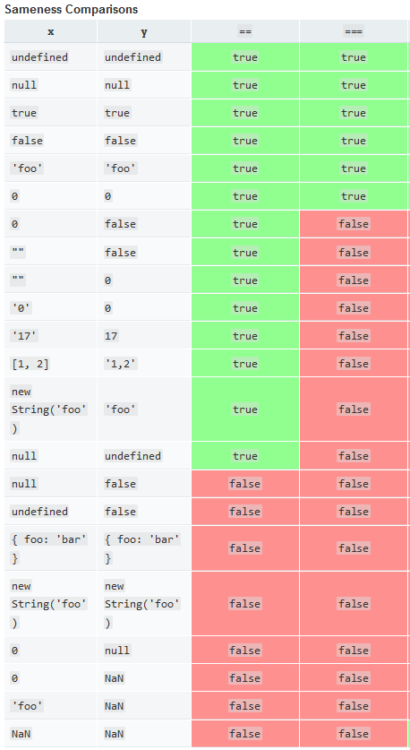

## Introduction to Javascript

1. Data Types - Basic

```javascript
var a = 1; // Number
var b = 2.3; // Number
var c = "A"; // String
var d = "ABC"; // String
var f = "ABC"; // String
```

2. Data Types - Advanced

```javascript
var a = undefined; // undefined
var b = null; // Object
var c = {}; // Object
var d = function (a, b) {
  return a + b;
}; // Function
```

3. Equality Operators in Javascript

- Complete Reference : [https://developer.mozilla.org/en-US/docs/Web/JavaScript/Equality_comparisons_and_sameness](https://developer.mozilla.org/en-US/docs/Web/JavaScript/Equality_comparisons_and_sameness)
- triple equals (===) will do the same comparison as double equals but without type conversion; if the types differ, false is returned.



4. Scope in Javascript

- Scope refers to the visibility of variables in a particular block of code.
- Global / Module level scoping rules are different for browser vs NodeJS.
- Global scope in the browser :

```javascript
// Any variable declared outside a function or code block belongs to global object
// window is the global object in the browser.
// All browser apis accessed via global object (window).
var a = 1;
function printA() {
  console.log(a); // 1
  console.log(window.a); // 1
}
```

- Function Scope :

```javascript
function hoisting() {
  // Function Scope starts
  console.log(i);
  // Block starts
  for (var i = 0; i < 2; i++) {
    console.log(i);
  }
  // Block ends here
  console.log(i);
  // Function Scope ends
}
hoisting();
```

Above code is interpreted as :

```javascript
function hoisting() {
  var a;
  console.log(i); // undefined
  for (i = 0; i < 2; i++) {
    console.log(i); // 0, 1
  }
  console.log(i); // 2
}
hoisting();
```

## ES6 Syntax

- In its simplest form, it is the set of syntax which will be make large-scale JavaScript development easy. Briefly features include : [Blog](https://medium.com/@jinalshah999/introduction-to-es6-main-concepts-5589e5a07dd)

- What is difference between ECMA Script and JavaScript? : [Blog](https://www.freecodecamp.org/news/whats-the-difference-between-javascript-and-ecmascript-cba48c73a2b5/)


- **Block Scope (let & const)** :
    -  Understand the need to use ```let``` over ```var```, issues with ```var```: [Blog](https://josephcardillo.medium.com/the-difference-between-var-let-and-const-in-javascript-part-2-60fa568d0a0)


```javascript
if (true) {
  // In short var is function scoped let and const are block scoped
  let a = 1;
  const b = 2;
  var c = 3;
  console.log(a); // 1
  console.log(b); // 2
  console.log(c); // 3
}
console.log(a); // Error
console.log(b); // Error
console.log(c); // 3
```

- Arrow Functions
    -   Read more about arrow functions here: [Blog](https://levelup.gitconnected.com/what-are-arrow-functions-and-how-are-they-different-from-regular-functions-8f452ecd036c)
```javascript
    // Traditional Function
    function (a, b){
    let chuck = 42;
    return a + b + chuck;
    }
    // Arrow Function
    (a, b) => {
        let chuck = 42;
        return a + b + chuck;
    }
```

5. Execution context :

- Context is used to refer to the value of this in some particular part of your code.

```javascript
console.log(this); // Logs Window (Global Object)
function myFunc() {
  console.log(this);
}
var a = { name: "Mridul" };
myFunc(); // Logs Window (Global Object)
myFunc.apply(a); // Logs Object { name: "Mridul" }
```

- Another example of context when directly calling a function

```javascript
var a = 1;
var b = { a: 2 };
function print() {
  console.log(this.a);
}
print(); // Logs 1
print.apply(b); // Logs 2
```

- Create a person object

```javascript
let name = "Morgan";
var a = {
  name: "Mridul",
  printName: function () {
    console.log(this.name);
  },
};
a.printName(); // Mridul
a.printName.apply(this); // Morgan
```

- function.call(), function.bind(), function.apply() provide same functionality but with different syntax
- Case 1 : ObjectName.functionName() => this = ObjectName
- Case 2 : functionName() => this = Window (global)

## Further Reading

- [https://scotch.io/tutorials/understanding-scope-in-javascript](https://scotch.io/tutorials/understanding-scope-in-javascript)
- [https://scotch.io/tutorials/why-this-in-javascript](https://scotch.io/tutorials/why-this-in-javascript)


- JS Event loop : [Blog](https://blog.sessionstack.com/how-javascript-works-event-loop-and-the-rise-of-async-programming-5-ways-to-better-coding-with-2f077c4438b5)
- Callback Functions : [Blog](https://codeburst.io/javascript-what-the-heck-is-a-callback-aba4da2deced)
- NodeJS : [Blog](https://medium.com/altcampus/introduction-to-nodejs-1d5b08b662a4)
